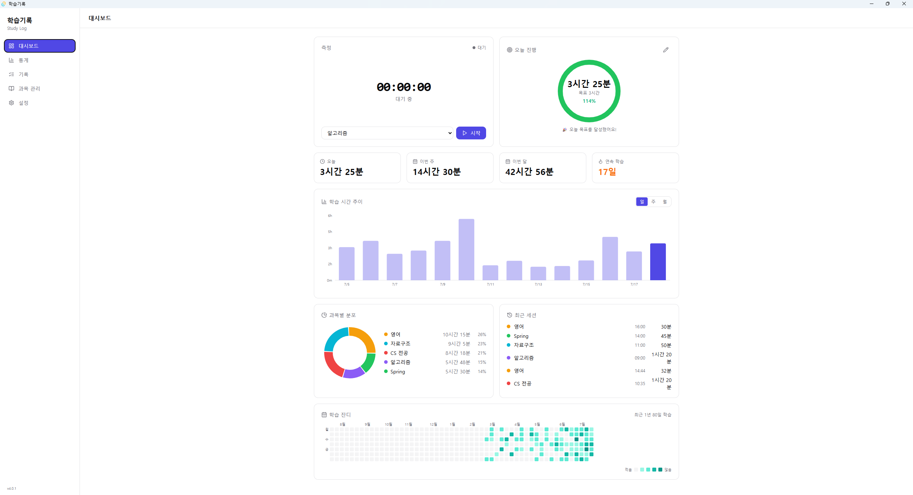
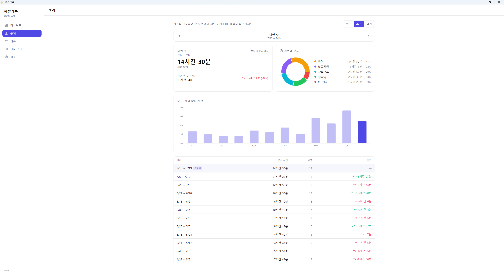
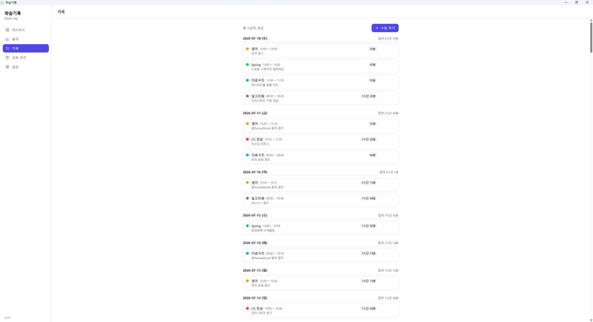
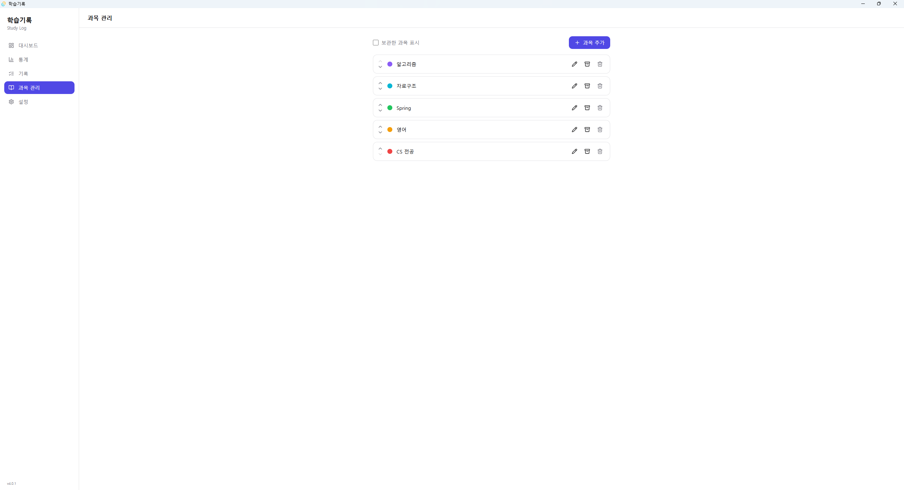
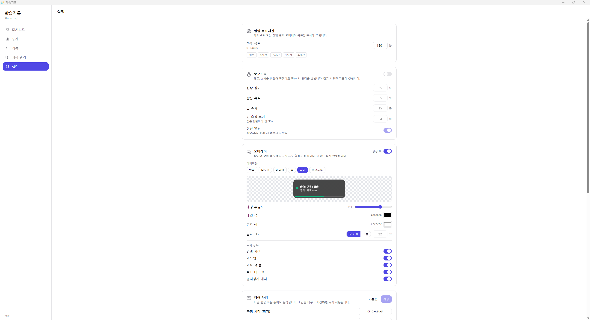
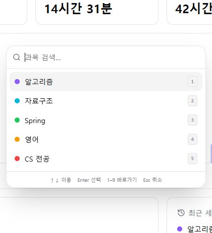

# 학습기록 (Study Log)

> 서버·클라우드 없이 **로컬에서 동작하는 개인용 학습시간 기록 데스크톱 앱** (Windows)

학습 시간을 측정·기록하고 일/주/월 통계를 시각화합니다. 모든 데이터는 내 PC의 로컬 SQLite에만 저장되어 밖으로 나가지 않습니다.

<p>
  
  
  
</p>

---

## 📸 스크린샷

### 대시보드
측정 · 오늘 목표 링 · 일/주/월/연속 요약 · 학습시간 추이 차트 · 과목별 도넛 · 최근 세션 · **학습 잔디 히트맵**(최근 1년 일별 학습량)



### 통계
기간(일/주/월) 전환 · 좌우 이동 · 과목별 도넛 · 직전 기간 대비 증감



### 기록
날짜별 세션 그룹 · 수동 추가/수정/삭제 · 메모



### 과목 관리
과목 추가/수정 · 색상 지정 · 보관 · 순서 변경



### 설정
목표 시간 · 뽀모도로 · 오버레이 레이아웃 · 전역 핫키 · GitHub 백업



### 타이머 오버레이 (레이아웃 6종)
다른 앱 위에 항상 떠 있는 작은 측정 오버레이. 색·투명도·글자·표시 항목은 공유하고 배치/모양만 6가지 중 선택합니다.

| 알약 (Pill) | 디지털 (Digital) | 미니멀 (Minimal) |
|:---:|:---:|:---:|
|  |  |  |
| **링 (Ring)** | **막대 (Bar)** | **뽀모도로 (Pomodoro)** |
|  |  |  |

### 빠른 시작 피커
전역 핫키로 어디서든 과목을 골라 즉시 측정 시작



---

## ✨ 주요 기능

- **학습시간 측정** — 시작/일시정지/재개/종료. 측정 상태는 Rust 코어가 단일 소스로 관리해 창을 새로 열거나 리로드해도 복구됩니다.
- **항상 위 타이머 오버레이** — 다른 앱 위에 떠 있는 작은 타이머. 드래그 이동·크기조절, 위치/크기 자동 복원, **레이아웃 6종**(알약·디지털·미니멀·링·막대·뽀모도로).
- **전역 핫키 + 빠른 시작 피커** — 다른 프로그램을 쓰는 중에도 단축키로 측정 시작/종료/일시정지 및 과목 선택.
- **뽀모도로** — 집중/휴식 자동 전환(휴식은 측정 자동 일시정지로 처리 → 집중 시간만 적립)과 데스크톱 알림.
- **대시보드** — 오늘 목표 링, 일/주/월/연속 학습일 요약, 학습시간 추이 막대차트, 과목별 도넛, 최근 세션, **학습 잔디 히트맵**.
- **통계** — 일간/주간/월간 전환, 기간 이동, 직전 기간 대비 증감.
- **기록 관리** — 세션 수동 추가/수정/삭제, 메모, 날짜별 그룹.
- **과목 관리** — 색상 지정, 보관, 순서 변경.
- **시스템 트레이 상주** — 창을 닫아도 백그라운드 유지, 트레이 메뉴로 제어.
- **Windows 자동 시작** — 부팅 시 조용히 트레이로 상주(선택).
- **GitHub 백업/복원** — 데이터를 내 GitHub 저장소에 백업하고 복원. **세션 종료 시 자동 백업**(백그라운드) 지원.
- **비정상 종료 자동 복구** — 측정 중 PC가 꺼져도 마지막 시점까지 세션 자동 저장.
- **자동 업데이트** — 새 버전 확인 → 다운로드 → 설치 → 재시작(서명 검증).

---

## 🧰 기술 스택

| 구분 | 사용 |
|------|------|
| 데스크톱 프레임워크 | **Tauri v2** |
| 프론트엔드 | **React 19 + TypeScript** |
| 스타일 | **Tailwind CSS + shadcn/ui** |
| 로컬 저장 | **SQLite** (`tauri-plugin-sql`, ORM 없이 직접 SQL) |
| 백엔드 코어 | **Rust** |
| 차트 | **Recharts** |

---

## 📥 설치 (사용자용)

1. [**Releases**](https://github.com/pyjhoop/study-log/releases) 페이지에서 최신 `StudyLog_x.x.x_x64-setup.exe`를 내려받습니다.
2. 설치 파일을 실행합니다.
   - ⚠️ 코드 서명이 없는 빌드라 첫 실행 시 Windows SmartScreen이 "알 수 없는 게시자" 경고를 띄울 수 있습니다 → **추가 정보 → 실행**을 눌러 진행하세요.
3. 설치 후 앱을 실행하면 트레이에 상주하며, 데이터는 `%APPDATA%\com.studylog.app\studylog.db`에 저장됩니다.

> 이후 버전부터는 앱이 시작할 때 새 버전을 자동으로 확인하고 업데이트할 수 있습니다.

---

## 🚀 사용법

### 1) 과목 만들기
**과목 관리** 탭에서 공부할 과목을 추가하고 색상을 지정합니다. (측정하려면 과목이 최소 1개 필요)

### 2) 측정 시작
- **대시보드**의 측정 카드에서 과목을 고르고 **시작**, 또는
- 전역 핫키 **`Ctrl+Alt+S`** → 빠른 시작 피커에서 과목 선택(↑/↓·숫자키·Enter).

측정을 시작하면 화면 위에 타이머 오버레이가 떠서 다른 앱을 쓰는 중에도 경과 시간이 보입니다.

### 3) 측정 제어 (기본 전역 핫키)

| 동작 | 단축키 |
|------|--------|
| 빠른 시작 피커 | `Ctrl + Alt + S` |
| 측정 종료 | `Ctrl + Alt + E` |
| 일시정지 / 재개 | `Ctrl + Alt + P` |
| 대시보드 열기 | `Ctrl + Alt + D` |
| 오버레이 표시 / 숨김 | `Ctrl + Alt + H` |

> 핫키는 **설정 → 전역 핫키**에서 원하는 조합으로 바꿀 수 있습니다.

### 4) 돌아보기
- **대시보드** — 오늘 진행률과 최근 추이를 한눈에.
- **통계** — 기간을 바꿔가며 상세 분석.
- **기록** — 세션을 직접 추가/수정/삭제.

### 5) (선택) 백업 · 자동 시작 · 뽀모도로
**설정** 탭에서 목표 시간, 뽀모도로, 오버레이 레이아웃, Windows 자동 시작, GitHub 백업을 설정할 수 있습니다.

---

## 🛠 개발 (빌드)

### 사전 준비
- [Rust 툴체인](https://www.rust-lang.org/tools/install) (cargo)
- Node.js 20+ / npm
- Windows: Tauri 요구사항([WebView2](https://developer.microsoft.com/microsoft-edge/webview2/), Visual Studio C++ Build Tools)

### 명령
```bash
npm install          # 최초 1회 (의존성 설치)
npm run tauri dev    # 개발 모드 (Vite + Tauri, 첫 Rust 빌드는 1~2분)
npm run build        # 프론트 타입체크 + 번들 (빠른 검증용)
npm run tauri build  # 배포용 설치 파일 생성 (NSIS)
```

---

## 🗂 프로젝트 구조

```
src/                 # React (프론트엔드)
  windows/           # MainApp / TimerOverlay / QuickStart (window.label로 분기)
  components/        # 화면·재사용 UI (dashboard/stats/records/subjects/settings/overlay …)
  hooks/             # useSession 등 커맨드/이벤트 래핑
  lib/               # db.ts(SQL) · ipc.ts(invoke) · stats.ts · types.ts …
src-tauri/
  src/               # lib.rs · commands.rs · state.rs · tray.rs
  migrations/        # SQL 마이그레이션
  capabilities/      # 창별 최소 권한
docs/                # 기획·결정 문서
```

3-창 구조(`main` / `timer` / `quickstart`)가 하나의 프론트 번들을 공유하고, React ↔ Rust는 `invoke`(커맨드)와 `event`(브로드캐스트)로만 통신합니다. 측정 상태는 Rust가 단일 소스로 보유합니다.

---

## 📚 문서

- [기술 스택 결정](docs/01-기술스택-결정.md)
- [핵심 기능 기획서](docs/02-핵심기능-기획서.md)
- [v2 기능 기획](docs/03-v2-기능-기획.md)
- [안정성 보강](docs/04-안정성-보강.md)
- [자동 업데이트](docs/05-자동-업데이트.md)
- 개발 진행 상황: [`PROGRESS.md`](PROGRESS.md)

---

## 📄 라이선스

개인용 프로젝트입니다.
